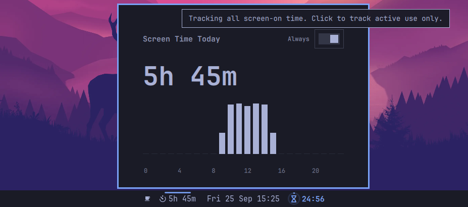

# omasot — Screen Time Tracker for Omarchy

A lightweight screen time tracker plugin for the [Omarchy](https://omarchy.org/) shell bar. Shows your daily screen-on time at a glance and provides an hourly breakdown chart when clicked.

## Features

- **Bar widget** — displays total screen time today (e.g. `2h 34m`)
- **Hourly chart** — click the widget to see a 24-hour bar chart of usage
- **Idle-aware** — only counts active time; pauses when you're away
- **Theme-aware** — adapts colors to your current Omarchy theme
- **Lightweight** — simple Python backend, no daemons or databases

## Screenshot



## Requirements

- **Omarchy Quattro** with Quickshell
- **Python 3** (pre-installed on Omarchy)

## Installation

```bash
omarchy plugin add https://github.com/kamal-v8/omasot.git --enable
```

This clones the plugin and enables it in your bar automatically.

Alternatively, you can manually clone and configure:

```bash
git clone https://github.com/kamal-v8/omasot.git ~/.config/omarchy/plugins/omasot
```

Then add it to your bar in `~/.config/omarchy/shell.json`:

```json
{
  "id": "omasot"
}
```

The shell hot-reloads on save — no restart needed.

## Removal

Remove from your bar layout in `~/.config/omarchy/shell.json`, then delete the plugin:

```bash
rm -rf ~/.config/omarchy/plugins/omasot
```

Optionally remove the state file:

```bash
rm ~/.local/state/screentime.json
```

## How It Works

1. A background **service** runs a 60-second timer. Each tick, it checks your idle status via Quickshell's `IdleMonitor`. It then calls `tracker.py record` to log one minute.
2. The **bar widget** calls `tracker.py` (no args) every 60 seconds to read today's total and display it.
3. Clicking the widget opens a **panel** with a 24-hour bar chart showing minutes per hour.
4. The panel includes a toggle button in the top right to switch between "Active" tracking (pauses when your system is idle for 60 seconds) and "Always" tracking (records continuously as long as your laptop is awake).
5. Data is stored in `~/.local/state/screentime.json` as a simple JSON object keyed by date and hour. Entries older than 30 days are pruned automatically.

## External Dependencies

| Dependency | Purpose | Included in Omarchy? |
|------------|---------|---------------------|
| Python 3 | Data recording and reading | Yes |

## License

[MIT](LICENSE)
