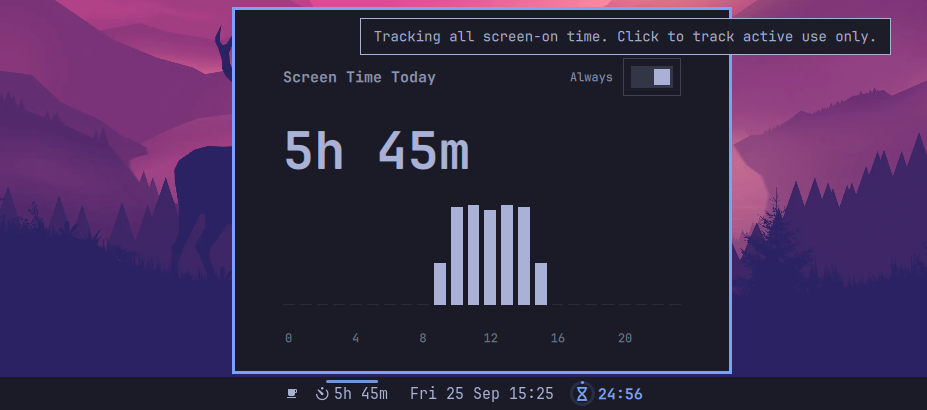

# omasot — Screen Time Tracker for Omarchy

A lightweight screen time tracker plugin for the [Omarchy](https://omarchy.org/) shell bar. Shows your daily screen-on time at a glance and provides an hourly breakdown chart when clicked.

## Features

- **Bar widget** — displays total screen time today (e.g. `2h 34m`)
- **Daily view** — hourly bars with a right-hand value axis; unused small hours collapse into one narrow `0–9` block so the hours you use get the width
- **Weekly view** — Mon–Sun bars with a value axis, week total and share of 168h, and a FOCUSED / OVERALL switch: focused counts only time attributed to an app, overall adds idle, lock and empty-desktop time
- **App stats** — per-app usage for today or any day you click in the weekly chart (top-6 + Other with time and % share, plus an Idle / other row so the day reconciles); Show more expands all
- **Identity modes** — Simple records window class only (e.g. zen/foot); Smart resolves the foreground process inside terminals (e.g. opencode not foot), uses the game title for steam_app_<id>, and shortens reverse-DNS names
- **Private by design** — window titles are never stored except Steam game titles; fully local, no network access
- **Tracking Modes** — use the mode switch in the panel to switch between "Active" (measures only actively used time) and "Always" (measures total screen-on time, whether being used or unused)
- **Theme-aware** — adapts colors to your current Omarchy theme
- **Lightweight** — simple Python backend, no daemons or databases

## Screenshot



## Requirements

- **Omarchy Quattro** with Quickshell
- **Python 3** (pre-installed on Omarchy)

## Installation

```bash
omarchy plugin add https://github.com/kamal-v8/omasot.git --enable
```

This clones the plugin and enables it in your bar automatically.

Alternatively, you can manually clone and configure:

```bash
git clone https://github.com/kamal-v8/omasot.git ~/.config/omarchy/plugins/omasot
```

Then add it to your bar in `~/.config/omarchy/shell.json`:

```json
{
  "id": "omasot"
}
```

The shell hot-reloads on save — no restart needed.

## Usage

Click the widget to open the details panel. Press Escape to close it. Click the
mode switch in the top-right of the panel to switch between `Active` and
`Always` tracking.

The Weekly view shows the week at a glance; the Apps view breaks a day down:

- Use the week pager (`‹ Sep 7 – 13, 2026 · W37 ›`) to move between weeks. Bars show Mon–Sun totals with the week total and share of 168h. Switch FOCUSED / OVERALL to compare app-attributed time against total screen-on time; hovering a bar always shows both.
- Click a day to see its top apps. Each row shows time and % share; top-6 plus Other are shown by default and Show more expands all.

Click the gear icon for Settings:

- Weekly view toggle
- App view toggle
- App icons toggle
- Tracking mode: Off / Simple / Smart
- History retention: 30 / 90 / 180 / 365 days (default 365, max 365)

## Removal

Remove from your bar layout in `~/.config/omarchy/shell.json`, then remove the plugin:

```bash
omarchy plugin remove omasot
```

Optionally remove the state file:

```bash
rm ~/.local/state/screentime.json
```

## How It Works

1. A background **service** runs a 60-second timer. Each tick, it checks your idle status via Quickshell's `IdleMonitor`. It then calls `tracker.py record` to log one minute.
2. The **bar widget** calls `tracker.py` (no args) every 60 seconds to read today's total and display it.
3. Clicking the widget opens a **panel** with a 24-hour bar chart showing minutes per hour.
4. The mode switch in the panel switches between **Active** (monitors only active use cases, pausing when idle) and **Always** (tracks all screen-on usage).
5. Data is stored in `~/.local/state/screentime.json` as a simple JSON object keyed by date and hour, with per-day `_apps` seconds for per-app totals. Old days are pruned according to the retention setting (30/90/180/365 days, default 365, max 365). No network access, no elevated privileges.
6. A background attribution loop polls `hyprctl activewindow` every 5 seconds and credits 5 seconds to the focused app. Idle time attributes nothing, and disabled (Off) mode attributes nothing.
7. App identity depends on tracking mode: Simple records window class only (e.g. zen/foot); Smart resolves the foreground process inside terminals (e.g. opencode not foot), uses the game title for `steam_app_<id>`, and shortens reverse-DNS names. Window titles are never stored except Steam game titles. All resolution is local with no network access.
8. Attribution splits at midnight so seconds before and after midnight count toward their respective days.

## External Dependencies

| Dependency | Purpose | Included in Omarchy? |
|------------|---------|---------------------|
| Python 3 | Data recording and reading | Yes |
| hyprctl | Focused-window attribution | Yes |

## License

[MIT](LICENSE)
